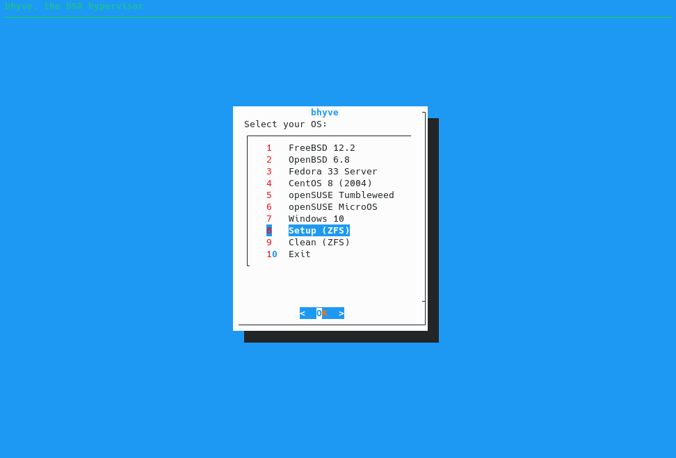

<!--
{}
This is a placeholder page that shows you how to use this template site.
{}
-->

The bhyve BSD-licensed hypervisor became part of the base system with FreeBSD&trade; 10.0-RELEASE.
This hypervisor supports a number of guests, including FreeBSD&trade;, OpenBSD&trade;, Windows&reg; and many Linux&reg; distributions.

I wrote a simple shell script to manage my virtual machines with bhyve under FreeBSD.

{}
The shell script is only for small projects like mine, if you are looking for something advanced you should consider [CBSD](http://cbsd.io).
{}

The first step to create a virtual machine with bhyve is to download my script using [git](https://git-scm.com/).
```html
# git clone https://github.com/amressamio/VMs.git
```

Change the directory to VMs.
```html
# cd VMs
```

Change the permission of the shell script.
```html
# chmod +x bhyve
```

Run bhyve shell script.
```html
# ./bhyve
```

{}
You have to run setup first to install virtual machines.

{}

When you choose to install any OS, the script downloads the ISO image in /zroot/VMs/ISOs. Except for MS Windows&reg;
you must download it manually and copy it to /zroot/VMs/ISOs the script will ask for VM name, RAM, CPUs and disk size
after that it will create your VM and you should be able to complete the installation by VNC viewer in my case tigerVNC.
The bhyve script will use ports range 5900-5999, it means first VM will use port 5900, second VM will use 5901 etc.

{}
To access your VM with VNC, type 192.168.100.100:5900, change 192.168.100.100 with your machine IP address.
{}

When you create a virtual machine, the script create an rc script to manage your virtual machine check the following example:

To start your virtual machine.
```html
# service VM_NAME start
```

To stop your virtual machine.
```html
# service VM_NAME stop
```

To delete your virtual machine.
```html
# service VM_NAME delete
```

<iframe width="560" height="315" src="https://www.youtube.com/embed/RmEzT05JO1E" frameborder="0" allow="accelerometer; autoplay; clipboard-write; encrypted-media; gyroscope; picture-in-picture" allowfullscreen></iframe>